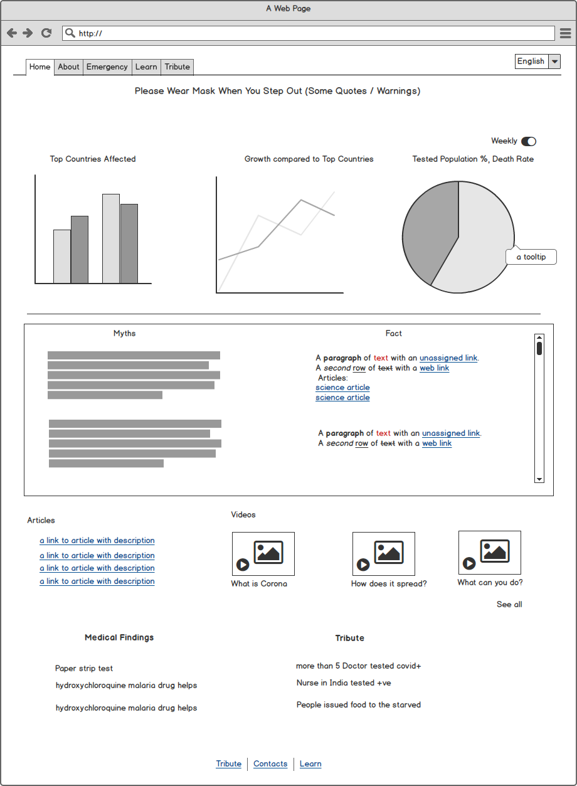

# Covid-Ed

Docs, Mocks and articles information needed for covided app

## Features
* We need content in local language, so it's useful for everyone (should be helpful than rumors)
* Should have %age along with numbers (coz population is not considered)
* FAQ / Myths (with science backed links / vids)
* Emergency Contact Information (Aggregate)
    - helplines
    - hospitals
    - report (do we even have this?)
        * could build this
* list of good videos (about covid, how it spreads) like a wiki
* possible to do remote meetup with experts?
* numbers are available in other sites, we should have daily increase in comparison with other countries
* on ed, since folks aren't serious we should have some content about other countries where it's critical/panic
* on postive end, what are the scientific findings

Sample Mock:

https://developers.google.com/maps/covid19

### Dev links
* [D3 Chart reference](http://bl.ocks.org/mikehadlow/93b471e569e31af07cd3)

## Content
* The coronavirus explained and what you should do, NutShell : [video](https://www.youtube.com/watch?v=BtN-goy9VOY)
* Not HumanMade Corona, sciencenews [article](https://www.sciencenews.org/article/coronavirus-covid-19-not-human-made-lab-genetic-analysis-nature)

